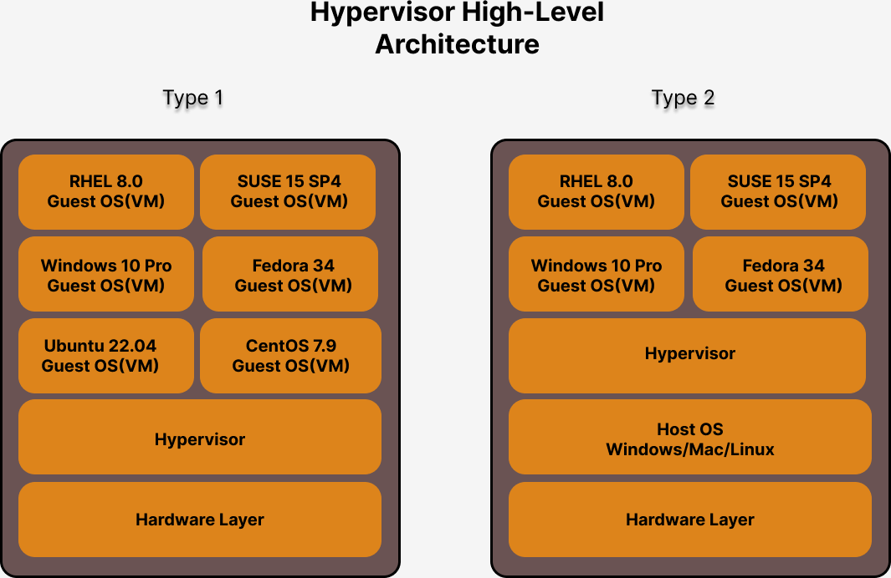

# Day1

## Lab Setup

Our Lab machine
- Ubuntu 20.04 64-bit OS
- Quad Core
- 32 GB RAM
- 500 GB HDD(Storage)

## For detailed installation instructions, you may refer the official documentation here
<pre>
https://docs.docker.com/engine/install/
</pre>

## Installing Docker Community Edition in Ubuntu 20.04 64-bit OS
```
sudo apt-get update
sudo apt-get install ca-certificates curl gnupg lsb-release -y
sudo mkdir -p /etc/apt/keyrings
curl -fsSL https://download.docker.com/linux/ubuntu/gpg | sudo gpg --dearmor -o /etc/apt/keyrings/docker.gpg

echo \
  "deb [arch=$(dpkg --print-architecture) signed-by=/etc/apt/keyrings/docker.gpg] https://download.docker.com/linux/ubuntu \
  $(lsb_release -cs) stable" | sudo tee /etc/apt/sources.list.d/docker.list > /dev/null
  
sudo apt-get update -y
sudo apt-get install docker-ce docker-ce-cli containerd.io docker-compose-plugin -y
sudo systemctl enable docker
sudo systemctl start docker
sudo systemctl status docker
sudo usermod -aG docker $USER
newgrp docker
docker --version
docker images
```

Expected output
<pre>
jegan@tektutor.org:~/Desktop$ <b>docker --version</b>
Docker version 20.10.21, build baeda1f

jegan@tektutor.org:~/Desktop$ <b>docker images</b>
REPOSITORY   TAG       IMAGE ID   CREATED   SIZE
</pre>

## What is HyperThreading(Intel)/SMT(AMD)?
- Processors that support Hyperthreading/SMT allow each phyical core to execute 2 to 8 threads at the same time
- Hyperthreading is Intel technology
- While SMT(Simulateneous Multi Threading) is AMD's equivalent technology
- Virtualization Softwares see each Physical core as 2 Virtual Cores if they support Hyperthreading/SMT
- In some high-end server grade Processors, each Physical core are seen as 8 Virtual Cores

## What is Hypervisor?
- general term used to refer to the Virtualization Technology
- Virtualization allows us to run many Operating Systems side by side as Guest OS on a single Desktop/Laptop/Server
- many Operating Systems can be active at the same time
- each Virtual Machine aka Guest OS are allocated with dedicated Hardware resources
- Each Virtual Machine will get
  - its own dedicated CPU Cores
  - its own dedicated RAM
  - its own dedicated Storage
  - its own Network Card(Virtual - Software Defined Network Card - NIC)
  - its own Graphics Card(Virtual)
- Assume you have a laptop with 4 Cores(Quad Core Processor), 16 GB RAM and 500 GB Hard Disk
  - in such a laptop/desktop how many maximum Virtual Machine(VMs - Guest OS) we can run in parallel?
- AMD Processor
  - the virtualization feature is called AMD-V
  - this must be enabled on the BIOS
- Intel Processor
  - the virtualization features is called VT-X
  - this must be enabled on the BIOS
- Examples
  - VMWare
    - VMWare Fusion (Virtualization Software that works in Mac OS-X) - Type 2
    - VMWare Workstation ( Virtualization Software that works on Windows/Linux ) - Type 2
    - VMWare vSphere/v-center - Type 1 Hypervisor ( Bare Metal Servers - Servers with no OS )
  - Oracle
    - Virtual Box (Free - works in Windows/Mac/Linux) - Type 2
  - Parallels ( Mac OS-X)
  - Microsoft
    - Hyper-V (Works from Windows 10 Pro onwards )
- this type of Virtualization is called Heavy Weight 
- each Virtual Machine represents one fully function Operating System
- the Operating System has its own dedicated OS Kernel

## Multi Chip Module
- Single Integrated Chip (IC) hosting multiple Processors
- The MCM Chip can be installed in a Single Socket on your Server grade Motherboard
- Let's assume a MCM IC hosting 8 Processors each supporting 128 Cores
  - total cores supported - 8 x 128 x 2 = 2048 cores

## Linux Kernel Features
- Supports two interesting features that enable container technology
  1. Namespace and
     - each container is separated from other containers as they run in a virtual sandbox environment
     - each container gets many namespaces
       - PID namespace
       - Network namespace, etc
  2. Control Group (CGroup)
     - it is through this feature, we can restrict a container hardware resource utilization
     - For instance, we can restrict a container using only 25% of CPU ( if the OS has let's 4 cores, the container can only use 1 core at the max )
 
## What is Containerization?
- is an application virtualization technology
- each container will host one application
- containers are not Operating System
- certain container features are similar to Operating System features but still container is a process not an OS
- each container gets its own Virtual Network Card(NIC)
- hence every container gets an IP Address
- each container has a Network Stack (7 OSI layers)
- each container has a file system
- container doesn't have its own OS Kernel
- each container runs in its namespace

## What are the different Container Tools available?
- LXC
- Rkt ( pronounced as Rocket )
- Podman

## Difference between Docker(Containers) and Virtualization
- Virtual Machine is a fully functional Operating System while a container just hosts an application with all its dependencies
- Each Virtual Machine get its own share of Hardware resources ( CPU Cores, RAM and Storage ), while containers share the hardware resources on the underlying Operating System where they run
- Virtual Machines are heavy weight while Containers are light-weight
- Only a limited number of Virtual Machines can be active on laptop while on the same laptop you could easily run 40~50 containers

## High Level Architecture of Virtualization(Hypervisor)


## High Level Architecture of Docker


## What is Docker Local Registry?
It is a folder on your Operating System where Docker maintains the images,containers, network, etc.,

## What is Docker Remote Registry?
It is a website - Docker Hub that hosts a whole bunch of Docker Images that you could download locally and run those containerized application locally with zero configurations or installations

## What is Docker Private Registry?
When you have your own Customized Docker Images that has your proprietary applications, you need a Docker Hub like registry within your office network so that Docker Images can be uploaded and can be accessed by other teams within your organization without worrying about any security issues.
We could setup a Private Docker Registry using any one of the below approach
- using Sonatype Nexus
- using JFrog Artifactory
- using regsitry:2 docker image from Docker Hub

## What is a Container Runtime?
- container Runtime is the software that manages containers
  - creating a container
  - listing a container
  - deleting a container
  - start a container
  - restarting a container
  - stopping a container
- end-users like us doesn't use Container Runtimes directly
- Container Runtimes are used by Container Engines to manage containers
- Example
  - runC is a Container Runtime
  - CRI-O is a Container Runtime
 
## What is a Container Engine?
- Container Runtimes are low-level tools
- Container Runtimes are used by Container Engine
- is a high-level user-friendly tool that allows to create containers and manage them without knowing any container technology internals
- Container Engines provide user-friendly commands to manage images and containers
- Examples
  - Docker is a Container Engine that uses runC Container Runtime
  - Podman is a Container Engine that used CRI-O Container Runtime

# Docker Commands

## Docker Overview
- Docker is developed in Go Programming Language by Docker Inc organization
- Docker comes in 2 flavours
  1. Community Edition (CE) - No official support (Good for opensource projects and learning purpose)
  2. Enterprise Edition (EE) - For commercial use (Comes with Support from Docker Inc)

## ⛹️‍♂️ Lab - Listing Docker Images from Local Docker Registry
```
docker images
```

## ⛹️‍♂️ Lab - Finding more details about your docker setup
```
docker info
```

Expected output
<pre>
jegan@tektutor.org:~/Desktop$ <b>docker info</b>
Client:
 Context:    default
 Debug Mode: false
 Plugins:
  app: Docker App (Docker Inc., v0.9.1-beta3)
  buildx: Docker Buildx (Docker Inc., v0.9.1-docker)
  compose: Docker Compose (Docker Inc., v2.12.2)
  scan: Docker Scan (Docker Inc., v0.21.0)

Server:
 Containers: 0
  Running: 0
  Paused: 0
  Stopped: 0
 Images: 0
 Server Version: 20.10.21
 Storage Driver: overlay2
  Backing Filesystem: extfs
  Supports d_type: true
  Native Overlay Diff: true
  userxattr: false
 Logging Driver: json-file
 Cgroup Driver: cgroupfs
 Cgroup Version: 1
 Plugins:
  Volume: local
  Network: bridge host ipvlan macvlan null overlay
  Log: awslogs fluentd gcplogs gelf journald json-file local logentries splunk syslog
 Swarm: inactive
 Runtimes: io.containerd.runtime.v1.linux runc io.containerd.runc.v2
 Default Runtime: runc
 Init Binary: docker-init
 containerd version: 1c90a442489720eec95342e1789ee8a5e1b9536f
 runc version: v1.1.4-0-g5fd4c4d
 init version: de40ad0
 Security Options:
  apparmor
  seccomp
   Profile: default
 Kernel Version: 5.15.0-52-generic
 Operating System: Ubuntu 20.04.3 LTS
 OSType: linux
 Architecture: x86_64
 CPUs: 4
 Total Memory: 4.072GiB
 Name: tektutor.org
 ID: PIAH:5RHX:IQ5Q:W35O:7SDD:J6CI:X33T:HKLS:MCFW:LOYC:NYOJ:6EXS
 Docker Root Dir: /var/lib/docker
 Debug Mode: false
 Registry: https://index.docker.io/v1/
 Labels:
 Experimental: false
 Insecure Registries:
  127.0.0.0/8
 Live Restore Enabled: false
</pre>

## ⛹️‍♂️ Lab - Downloading Docker Image from Docker Remote Registry (Docker Hub website) to Docker Local Registry
```
docker pull hello-world:latest
```

## ⛹️‍♂️ Lab - Finding more details about an image
```
docker image inspect hello-world:latest
```

Expected output
<pre>
jegan@tektutor.org:~/Desktop$ <b>docker image inspect hello-world:latest</b>
[
    {
        "Id": "sha256:feb5d9fea6a5e9606aa995e879d862b825965ba48de054caab5ef356dc6b3412",
        "RepoTags": [
            "hello-world:latest"
        ],
        "RepoDigests": [
            "hello-world@sha256:e18f0a777aefabe047a671ab3ec3eed05414477c951ab1a6f352a06974245fe7"
        ],
        "Parent": "",
        "Comment": "",
        "Created": "2021-09-23T23:47:57.442225064Z",
        "Container": "8746661ca3c2f215da94e6d3f7dfdcafaff5ec0b21c9aff6af3dc379a82fbc72",
        "ContainerConfig": {
            "Hostname": "8746661ca3c2",
            "Domainname": "",
            "User": "",
            "AttachStdin": false,
            "AttachStdout": false,
            "AttachStderr": false,
            "Tty": false,
            "OpenStdin": false,
            "StdinOnce": false,
            "Env": [
                "PATH=/usr/local/sbin:/usr/local/bin:/usr/sbin:/usr/bin:/sbin:/bin"
            ],
            "Cmd": [
                "/bin/sh",
                "-c",
                "#(nop) ",
                "CMD [\"/hello\"]"
            ],
            "Image": "sha256:b9935d4e8431fb1a7f0989304ec86b3329a99a25f5efdc7f09f3f8c41434ca6d",
            "Volumes": null,
            "WorkingDir": "",
            "Entrypoint": null,
            "OnBuild": null,
            "Labels": {}
        },
        "DockerVersion": "20.10.7",
        "Author": "",
        "Config": {
            "Hostname": "",
            "Domainname": "",
            "User": "",
            "AttachStdin": false,
            "AttachStdout": false,
            "AttachStderr": false,
            "Tty": false,
            "OpenStdin": false,
            "StdinOnce": false,
            "Env": [
                "PATH=/usr/local/sbin:/usr/local/bin:/usr/sbin:/usr/bin:/sbin:/bin"
            ],
            "Cmd": [
                "/hello"
            ],
            "Image": "sha256:b9935d4e8431fb1a7f0989304ec86b3329a99a25f5efdc7f09f3f8c41434ca6d",
            "Volumes": null,
            "WorkingDir": "",
            "Entrypoint": null,
            "OnBuild": null,
            "Labels": null
        },
        "Architecture": "amd64",
        "Os": "linux",
        "Size": 13256,
        "VirtualSize": 13256,
        "GraphDriver": {
            "Data": {
                "MergedDir": "/var/lib/docker/overlay2/00b84eed1addd323d784c90f968848158bf3e8275cc0b0dc6de2970dcc98b964/merged",
                "UpperDir": "/var/lib/docker/overlay2/00b84eed1addd323d784c90f968848158bf3e8275cc0b0dc6de2970dcc98b964/diff",
                "WorkDir": "/var/lib/docker/overlay2/00b84eed1addd323d784c90f968848158bf3e8275cc0b0dc6de2970dcc98b964/work"
            },
            "Name": "overlay2"
        },
        "RootFS": {
            "Type": "layers",
            "Layers": [
                "sha256:e07ee1baac5fae6a26f30cabfe54a36d3402f96afda318fe0a96cec4ca393359"
            ]
        },
        "Metadata": {
            "LastTagTime": "0001-01-01T00:00:00Z"
        }
    }
]
</pre>

## ⛹️‍♂️ Lab - Renaming a container
```
docker rename <current-container-name> <new-container-name>
```

## ⛹️‍♂️ Lab - Deleting an docker image from local registry
```
docker rmi hello-world:latest
```

Expected output
<pre>
jegan@tektutor.org:~/kubernetes-oct-2022$ <b>docker images</b>
REPOSITORY    TAG       IMAGE ID       CREATED         SIZE
nginx         latest    76c69feac34e   6 days ago      142MB
hello-world   latest    feb5d9fea6a5   13 months ago   13.3kB
ubuntu        16.04     b6f507652425   14 months ago   135MB
jegan@tektutor.org:~/kubernetes-oct-2022$ <b>docker rmi hello-world:latest</b>
Untagged: hello-world:latest
Untagged: hello-world@sha256:e18f0a777aefabe047a671ab3ec3eed05414477c951ab1a6f352a06974245fe7
Deleted: sha256:feb5d9fea6a5e9606aa995e879d862b825965ba48de054caab5ef356dc6b3412
Deleted: sha256:e07ee1baac5fae6a26f30cabfe54a36d3402f96afda318fe0a96cec4ca393359
</pre>

## ⛹️‍♂️ Lab - Creating a container and running the container
```
docker run hello-world:latest
```

Expected output
<pre>
jegan@tektutor.org:~/Desktop$ <b>docker run hello-world:latest</b>

Hello from Docker!
This message shows that your installation appears to be working correctly.

To generate this message, Docker took the following steps:
 1. The Docker client contacted the Docker daemon.
 2. The Docker daemon pulled the "hello-world" image from the Docker Hub.
    (amd64)
 3. The Docker daemon created a new container from that image which runs the
    executable that produces the output you are currently reading.
 4. The Docker daemon streamed that output to the Docker client, which sent it
    to your terminal.

To try something more ambitious, you can run an Ubuntu container with:
 $ docker run -it ubuntu bash

Share images, automate workflows, and more with a free Docker ID:
 https://hub.docker.com/

For more examples and ideas, visit:
 https://docs.docker.com/get-started/
</pre>


## ⛹️‍♂️ Lab - Creating an ubuntu container
```
docker run -dit --name c1 --hostname c1 ubuntu:16.04 /bin/bash
```

Expected output
<pre>
jegan@tektutor.org:~/Desktop$ docker run -dit --name c1 --hostname c1 ubuntu:16.04 /bin/bash
Unable to find image 'ubuntu:16.04' locally
16.04: Pulling from library/ubuntu
58690f9b18fc: Pull complete 
b51569e7c507: Pull complete 
da8ef40b9eca: Pull complete 
fb15d46c38dc: Pull complete 
Digest: sha256:1f1a2d56de1d604801a9671f301190704c25d604a416f59e03c04f5c6ffee0d6
Status: Downloaded newer image for ubuntu:16.04
eecfa4ad6752f8177314d2c244b1609fd6bfe09a8679c9a1d967ab313034f0bd
</pre>

## ⛹️‍♂️ Lab - Listing the currently running containers
```
docker ps
```

Expected output
<pre>
jegan@tektutor.org:~/Desktop$ <b>docker ps</b>
CONTAINER ID   IMAGE          COMMAND       CREATED              STATUS              PORTS     NAMES
eecfa4ad6752   ubuntu:16.04   "/bin/bash"   About a minute ago   Up About a minute             c1
</pre>

## Creating a container in interactively
```
docker run -it --name c1 --hostname c1 ubuntu:16.04 bash
```

Expected output
<pre>
jegan@tektutor.org:~/kubernetes-oct-2022$ <b>docker run -it --name c1 --hostname c1 ubuntu:16.04 bash</b>
root@c1:/# ls
bin  boot  dev  etc  home  lib  lib64  media  mnt  opt  proc  root  run  sbin  srv  sys  tmp  usr  var
root@c1:/# <b>hostname -i</b>
172.17.0.6
root@c1:/# <b>exit</b>
<b>exit</b>
</pre>


## ⛹️‍♂️ Lab - Finding more details about the container
```
docker inspect c1
```

Expected output
<pre>
jegan@tektutor.org:~/Desktop$ <b>docker inspect c1</b>
[
    {
        "Id": "eecfa4ad6752f8177314d2c244b1609fd6bfe09a8679c9a1d967ab313034f0bd",
        "Created": "2022-10-31T10:56:43.994465442Z",
        "Path": "/bin/bash",
        "Args": [],
        "State": {
            "Status": "running",
            "Running": true,
            "Paused": false,
            "Restarting": false,
            "OOMKilled": false,
            "Dead": false,
            "Pid": 6466,
            "ExitCode": 0,
            "Error": "",
            "StartedAt": "2022-10-31T10:56:44.779031657Z",
            "FinishedAt": "0001-01-01T00:00:00Z"
        },
        "Image": "sha256:b6f50765242581c887ff1acc2511fa2d885c52d8fb3ac8c4bba131fd86567f2e",
        "ResolvConfPath": "/var/lib/docker/containers/eecfa4ad6752f8177314d2c244b1609fd6bfe09a8679c9a1d967ab313034f0bd/resolv.conf",
        "HostnamePath": "/var/lib/docker/containers/eecfa4ad6752f8177314d2c244b1609fd6bfe09a8679c9a1d967ab313034f0bd/hostname",
        "HostsPath": "/var/lib/docker/containers/eecfa4ad6752f8177314d2c244b1609fd6bfe09a8679c9a1d967ab313034f0bd/hosts",
        "LogPath": "/var/lib/docker/containers/eecfa4ad6752f8177314d2c244b1609fd6bfe09a8679c9a1d967ab313034f0bd/eecfa4ad6752f8177314d2c244b1609fd6bfe09a8679c9a1d967ab313034f0bd-json.log",
        "Name": "/c1",
        "RestartCount": 0,
        "Driver": "overlay2",
        "Platform": "linux",
        "MountLabel": "",
        "ProcessLabel": "",
        "AppArmorProfile": "docker-default",
        "ExecIDs": null,
        "HostConfig": {
            "Binds": null,
            "ContainerIDFile": "",
            "LogConfig": {
                "Type": "json-file",
                "Config": {}
            },
            "NetworkMode": "default",
            "PortBindings": {},
            "RestartPolicy": {
                "Name": "no",
                "MaximumRetryCount": 0
            },
            "AutoRemove": false,
            "VolumeDriver": "",
            "VolumesFrom": null,
            "CapAdd": null,
            "CapDrop": null,
            "CgroupnsMode": "host",
            "Dns": [],
            "DnsOptions": [],
            "DnsSearch": [],
            "ExtraHosts": null,
            "GroupAdd": null,
            "IpcMode": "private",
            "Cgroup": "",
            "Links": null,
            "OomScoreAdj": 0,
            "PidMode": "",
            "Privileged": false,
            "PublishAllPorts": false,
            "ReadonlyRootfs": false,
            "SecurityOpt": null,
            "UTSMode": "",
            "UsernsMode": "",
            "ShmSize": 67108864,
            "Runtime": "runc",
            "ConsoleSize": [
                0,
                0
            ],
            "Isolation": "",
            "CpuShares": 0,
            "Memory": 0,
            "NanoCpus": 0,
            "CgroupParent": "",
            "BlkioWeight": 0,
            "BlkioWeightDevice": [],
            "BlkioDeviceReadBps": null,
            "BlkioDeviceWriteBps": null,
            "BlkioDeviceReadIOps": null,
            "BlkioDeviceWriteIOps": null,
            "CpuPeriod": 0,
            "CpuQuota": 0,
            "CpuRealtimePeriod": 0,
            "CpuRealtimeRuntime": 0,
            "CpusetCpus": "",
            "CpusetMems": "",
            "Devices": [],
            "DeviceCgroupRules": null,
            "DeviceRequests": null,
            "KernelMemory": 0,
            "KernelMemoryTCP": 0,
            "MemoryReservation": 0,
            "MemorySwap": 0,
            "MemorySwappiness": null,
            "OomKillDisable": false,
            "PidsLimit": null,
            "Ulimits": null,
            "CpuCount": 0,
            "CpuPercent": 0,
            "IOMaximumIOps": 0,
            "IOMaximumBandwidth": 0,
            "MaskedPaths": [
                "/proc/asound",
                "/proc/acpi",
                "/proc/kcore",
                "/proc/keys",
                "/proc/latency_stats",
                "/proc/timer_list",
                "/proc/timer_stats",
                "/proc/sched_debug",
                "/proc/scsi",
                "/sys/firmware"
            ],
            "ReadonlyPaths": [
                "/proc/bus",
                "/proc/fs",
                "/proc/irq",
                "/proc/sys",
                "/proc/sysrq-trigger"
            ]
        },
        "GraphDriver": {
            "Data": {
                "LowerDir": "/var/lib/docker/overlay2/a647af5db11f9868b74e90265b5d8ff77028bf143496c247e65b1cdaecceb543-init/diff:/var/lib/docker/overlay2/8577c7c75e49c6d5fadd912ae32411a984ac3ae1059d84406ca250d3c6aa001c/diff:/var/lib/docker/overlay2/532b3f8e47057e1c9ad415479e200102e6d3099cf95cb5bc7862dd4568377738/diff:/var/lib/docker/overlay2/c874c623654d00d8574e68d99e7c5b6dbd5f13acbc32622a34c955797718b878/diff:/var/lib/docker/overlay2/f24ce5398abe32b4a475fae91b691269ebffae597d66a58759ebdf73e6c2fb6a/diff",
                "MergedDir": "/var/lib/docker/overlay2/a647af5db11f9868b74e90265b5d8ff77028bf143496c247e65b1cdaecceb543/merged",
                "UpperDir": "/var/lib/docker/overlay2/a647af5db11f9868b74e90265b5d8ff77028bf143496c247e65b1cdaecceb543/diff",
                "WorkDir": "/var/lib/docker/overlay2/a647af5db11f9868b74e90265b5d8ff77028bf143496c247e65b1cdaecceb543/work"
            },
            "Name": "overlay2"
        },
        "Mounts": [],
        "Config": {
            "Hostname": "c1",
            "Domainname": "",
            "User": "",
            "AttachStdin": false,
            "AttachStdout": false,
            "AttachStderr": false,
            "Tty": true,
            "OpenStdin": true,
            "StdinOnce": false,
            "Env": [
                "PATH=/usr/local/sbin:/usr/local/bin:/usr/sbin:/usr/bin:/sbin:/bin"
            ],
            "Cmd": [
                "/bin/bash"
            ],
            "Image": "ubuntu:16.04",
            "Volumes": null,
            "WorkingDir": "",
            "Entrypoint": null,
            "OnBuild": null,
            "Labels": {}
        },
        "NetworkSettings": {
            "Bridge": "",
            "SandboxID": "70eb1099bd5066bfacfeb21483b16df931cdb8b72189eade3ddd0f4cf88f9856",
            "HairpinMode": false,
            "LinkLocalIPv6Address": "",
            "LinkLocalIPv6PrefixLen": 0,
            "Ports": {},
            "SandboxKey": "/var/run/docker/netns/70eb1099bd50",
            "SecondaryIPAddresses": null,
            "SecondaryIPv6Addresses": null,
            "EndpointID": "b99ae8444e9830d8b308a5d2a2cc0006ed64287fbc8ed97de04a38d71b6e50d5",
            "Gateway": "172.17.0.1",
            "GlobalIPv6Address": "",
            "GlobalIPv6PrefixLen": 0,
            "IPAddress": "172.17.0.2",
            "IPPrefixLen": 16,
            "IPv6Gateway": "",
            "MacAddress": "02:42:ac:11:00:02",
            "Networks": {
                "bridge": {
                    "IPAMConfig": null,
                    "Links": null,
                    "Aliases": null,
                    "NetworkID": "0b9dccdc3ff5354b71458bc221f002bdd753b97e18f5f59944e7c479a9288de9",
                    "EndpointID": "b99ae8444e9830d8b308a5d2a2cc0006ed64287fbc8ed97de04a38d71b6e50d5",
                    "Gateway": "172.17.0.1",
                    "IPAddress": "172.17.0.2",
                    "IPPrefixLen": 16,
                    "IPv6Gateway": "",
                    "GlobalIPv6Address": "",
                    "GlobalIPv6PrefixLen": 0,
                    "MacAddress": "02:42:ac:11:00:02",
                    "DriverOpts": null
                }
            }
        }
    }
]
</pre>

## ⛹️‍♂️ Lab - Finding the IP Address of a running container
```
docker inspect c1 | grep IPA
docker inspect -f {{.NetworkSettings.IPAddress}} c1
```

Expected output
<pre>
jegan@tektutor.org:~/Desktop$ <b>docker inspect c1 | grep IPA</b>
            "SecondaryIPAddresses": null,
            "IPAddress": "172.17.0.2",
                    "IPAMConfig": null,
                    "IPAddress": "172.17.0.2",
jegan@tektutor.org:~/Desktop$ <b>docker inspect -f {{.NetworkSettings.IPAddress}} c1</b>
172.17.0.2
</pre>

## ⛹️‍♂️ Lab - Finding the Mac Address of the running container
```
docker inspect -f {{.NetworkSettings.MacAddress}} c1
```

Expected output
<pre>
jegan@tektutor.org:~/Desktop$ <b>docker inspect -f {{.NetworkSettings.MacAddress}} c1</b>
02:42:ac:11:00:02
</pre>

## ⛹️‍♂️ Lab - Stopping a running container
```
docker ps
docker stop c1
docker ps 
docker ps -a
```

Expected output
<pre>
jegan@tektutor.org:~/Desktop$ <b>docker ps</b>
CONTAINER ID   IMAGE          COMMAND       CREATED          STATUS          PORTS     NAMES
eecfa4ad6752   ubuntu:16.04   "/bin/bash"   12 minutes ago   Up 12 minutes             c1
jegan@tektutor.org:~/Desktop$ <b>docker stop c1</b>
c1
jegan@tektutor.org:~/Desktop$ <b>docker ps</b>
CONTAINER ID   IMAGE     COMMAND   CREATED   STATUS    PORTS     NAMES
jegan@tektutor.org:~/Desktop$ <b>docker ps -a</b>
CONTAINER ID   IMAGE                COMMAND       CREATED          STATUS                      PORTS     NAMES
eecfa4ad6752   ubuntu:16.04         "/bin/bash"   12 minutes ago   Exited (0) 4 seconds ago              c1
578ea075c2d4   hello-world:latest   "/hello"      25 minutes ago   Exited (0) 25 minutes ago             hello-container1
</pre>


## ⛹️‍♂️ Lab - Starting an exited container
```
docker ps -a
docker start c1
docker ps
```

Expected output
<pre>
jegan@tektutor.org:~/Desktop$ <b>docker ps -a</b>
CONTAINER ID   IMAGE                COMMAND       CREATED          STATUS                      PORTS     NAMES
eecfa4ad6752   ubuntu:16.04         "/bin/bash"   12 minutes ago   Exited (0) 4 seconds ago              c1
578ea075c2d4   hello-world:latest   "/hello"      25 minutes ago   Exited (0) 25 minutes ago             hello-container1
jegan@tektutor.org:~/Desktop$ <b>docker start c1</b>
c1
jegan@tektutor.org:~/Desktop$ <b>docker ps</b>
CONTAINER ID   IMAGE          COMMAND       CREATED          STATUS        PORTS     NAMES
eecfa4ad6752   ubuntu:16.04   "/bin/bash"   15 minutes ago   Up 1 second             c1
</pre>

## ⛹️‍♂️ Lab - Restarting a running container
```
docker restart c1
```

Expected output
<pre>
jegan@tektutor.org:~/Desktop$<b>docker ps</b>
CONTAINER ID   IMAGE          COMMAND       CREATED          STATUS        PORTS     NAMES
eecfa4ad6752   ubuntu:16.04   "/bin/bash"   15 minutes ago   Up 1 second             c1
jegan@tektutor.org:~/Desktop$ <b>docker restart c1</b>
c1
jegan@tektutor.org:~/Desktop$ <b>docker ps</b>
CONTAINER ID   IMAGE          COMMAND       CREATED          STATUS         PORTS     NAMES
eecfa4ad6752   ubuntu:16.04   "/bin/bash"   17 minutes ago   Up 3 seconds             c1
</pre>

## ⛹️‍♂️ Lab - Deleting a running container gracefully
We need to stop the container before deleting it.

```
docker stop c1
docker rm c1
```

Expected output
<pre>
jegan@tektutor.org:~/Desktop$ <b>docker ps</b>
CONTAINER ID   IMAGE          COMMAND       CREATED          STATUS              PORTS     NAMES
eecfa4ad6752   ubuntu:16.04   "/bin/bash"   19 minutes ago   Up About a minute             c1
jegan@tektutor.org:~/Desktop$ <b>docker rm c1</b>
Error response from daemon: You cannot remove a running container eecfa4ad6752f8177314d2c244b1609fd6bfe09a8679c9a1d967ab313034f0bd. Stop the container before attempting removal or force remove
jegan@tektutor.org:~/Desktop$ <b>docker stop c1</b>
c1
jegan@tektutor.org:~/Desktop$ <b>docker rm c1</b>
c1
jegan@tektutor.org:~/Desktop$ <b>docker ps</b>
CONTAINER ID   IMAGE     COMMAND   CREATED   STATUS    PORTS     NAMES
jegan@tektutor.org:~/Desktop$ <b>docker ps -a</b>
CONTAINER ID   IMAGE                COMMAND    CREATED          STATUS                      PORTS     NAMES
578ea075c2d4   hello-world:latest   "/hello"   31 minutes ago   Exited (0) 31 minutes ago             hello-container1
</pre>

## ⛹️‍♂️ Lab - Deleting a running container forcibly
```
docker run -dit --name c1 --hostname c1 ubuntu:16.04 /bin/bash
docker ps 
docker rm -f c1
```

Expected output
<pre>
jegan@tektutor.org:~/Desktop$ <b>docker run -dit --name c1 --hostname c1 ubuntu:16.04 /bin/bash</b>
bc543e4b7c3a75255bf68301e83d570c29c505de3db86cc5211edc67eb618e97
jegan@tektutor.org:~/Desktop$ <b>docker ps</b>
CONTAINER ID   IMAGE          COMMAND       CREATED         STATUS         PORTS     NAMES
bc543e4b7c3a   ubuntu:16.04   "/bin/bash"   2 seconds ago   Up 2 seconds             c1
jegan@tektutor.org:~/Desktop$ <b>docker rm -f c1</b>
c1
jegan@tektutor.org:~/Desktop$ <b>docker ps -a</b>
CONTAINER ID   IMAGE                COMMAND    CREATED          STATUS                      PORTS     NAMES
578ea075c2d4   hello-world:latest   "/hello"   35 minutes ago   Exited (0) 35 minutes ago             hello-container1
</pre>

## ⛹️‍♂️ Lab - Deleting multiple containers gracefully
```
docker run -dit --name c1 --hostname c1 ubuntu:16.04 /bin/bash
docker run -dit --name c2 --hostname c2 ubuntu:16.04 /bin/bash
docker run -dit --name c3 --hostname c3 ubuntu:16.04 /bin/bash

docker ps
docker stop c1 c2 c3
docker rm c1 c2 c3
```

Expected output
<pre>
jegan@tektutor.org:~/Desktop$ <b>docker run -dit --name c1 --hostname c1 ubuntu:16.04 /bin/bash</b>
a02536dade46408192d2abe3562e48b34069722cf668f7a5f32f8eac6310bf30
jegan@tektutor.org:~/Desktop$ <b>docker run -dit --name c2 --hostname c2 ubuntu:16.04 /bin/bash</b>
9ff4a1c0d0a18eb31826845af46bfec144e629f0c7aa29bd2880809c5f0b6139
jegan@tektutor.org:~/Desktop$ <b>docker run -dit --name c3 --hostname c3 ubuntu:16.04 /bin/bash</b>
3bebc34f96ead4e6c998a49944920aff0a5cdb4d8026f1ef7a3e41b5c8c57b3c
jegan@tektutor.org:~/Desktop$ <b>docker ps</b>
CONTAINER ID   IMAGE          COMMAND       CREATED          STATUS          PORTS     NAMES
3bebc34f96ea   ubuntu:16.04   "/bin/bash"   2 seconds ago    Up 1 second               c3
9ff4a1c0d0a1   ubuntu:16.04   "/bin/bash"   8 seconds ago    Up 6 seconds              c2
a02536dade46   ubuntu:16.04   "/bin/bash"   14 seconds ago   Up 12 seconds             c1
jegan@tektutor.org:~/Desktop$ <b>docker stop c1 c2 c3</b>
c1
c2
c3
jegan@tektutor.org:~/Desktop$ <b>docker rm c1 c2 c3</b>
c1
c2
c3
jegan@tektutor.org:~/Desktop$ <b>docker ps -a</b>
CONTAINER ID   IMAGE                COMMAND    CREATED          STATUS                      PORTS     NAMES
578ea075c2d4   hello-world:latest   "/hello"   38 minutes ago   Exited (0) 38 minutes ago             hello-container1
</pre>

## ⛹️‍♂️ Lab - Deleting multiple containers gracefully without using their name
Let's create 5 containers
```
docker run -dit --name c1 --hostname c1 ubuntu:16.04 /bin/bash
docker run -dit --name c2 --hostname c2 ubuntu:16.04 /bin/bash
docker run -dit --name c3 --hostname c3 ubuntu:16.04 /bin/bash
docker run -dit --name c4 --hostname c4 ubuntu:16.04 /bin/bash
docker run -dit --name c5 --hostname c5 ubuntu:16.04 /bin/bash
```

Let's list and see if the containers are running
```
docker ps
```

Let's stop them all and delete them
```
docker stop $(docker ps -q)
docker rm $(docker ps -aq)
```

Expected output
<pre>
jegan@tektutor.org:~/Desktop$ <b>docker run -dit --name c1 --hostname c1 ubuntu:16.04 /bin/bash</b>
b878925bf45a9cb98fda8dbe86ffea6888f0367335d6ffcd2f34514b3afc552b
jegan@tektutor.org:~/Desktop$ <b>docker run -dit --name c2 --hostname c2 ubuntu:16.04 /bin/bash</b>
c6917b964a260b9eac6622e4e906e9ff52017eacf304bb5141514bc01e1dc82a
jegan@tektutor.org:~/Desktop$ <b>docker run -dit --name c3 --hostname c3 ubuntu:16.04 /bin/bash</b>
c2f0067f0c599858c0637b658af733650db125895a11eebd2e9ccc8acf920c90
jegan@tektutor.org:~/Desktop$ <b>docker run -dit --name c4 --hostname c4 ubuntu:16.04 /bin/bash</b>
7b3338a2cece09b97730d40b30b07f0d4e6e79810641ba975a0983bed713c39e
^[[Ajegan@tektutor.org:~/Desktop$ <b>docker run -dit --name c5 --hostname c5 ubuntu:16.04 /bin/bash</b>
51d07ce93e33b1e889a8721a3cd34f9eb278d036db10e7c3378fbe9256c3a77f
jegan@tektutor.org:~/Desktop$ <b>docker ps</b>
CONTAINER ID   IMAGE          COMMAND       CREATED              STATUS              PORTS     NAMES
51d07ce93e33   ubuntu:16.04   "/bin/bash"   2 seconds ago        Up 1 second                   c5
7b3338a2cece   ubuntu:16.04   "/bin/bash"   8 seconds ago        Up 7 seconds                  c4
c2f0067f0c59   ubuntu:16.04   "/bin/bash"   About a minute ago   Up About a minute             c3
c6917b964a26   ubuntu:16.04   "/bin/bash"   About a minute ago   Up About a minute             c2
b878925bf45a   ubuntu:16.04   "/bin/bash"   About a minute ago   Up About a minute             c1
jegan@tektutor.org:~/Desktop$ <b>docker ps -q</b>
51d07ce93e33
7b3338a2cece
c2f0067f0c59
c6917b964a26
b878925bf45a
jegan@tektutor.org:~/Desktop$ <b>docker stop $(docker ps -q)</b>
51d07ce93e33
7b3338a2cece
c2f0067f0c59
c6917b964a26
b878925bf45a
jegan@tektutor.org:~/Desktop$ <b>docker ps -q</b>
jegan@tektutor.org:~/Desktop$ <b>docker ps -aq</b>
51d07ce93e33
7b3338a2cece
c2f0067f0c59
c6917b964a26
b878925bf45a
jegan@tektutor.org:~/Desktop$ <b>docker rm $(docker ps -aq)</b>
51d07ce93e33
7b3338a2cece
c2f0067f0c59
c6917b964a26
b878925bf45a
jegan@tektutor.org:~/Desktop$ <b>docker ps -a</b>
CONTAINER ID   IMAGE     COMMAND   CREATED   STATUS    PORTS     NAMES
</pre>

## ⛹️‍♂️ Lab - Deleting multiple running containers forcibly
```
docker rm -f $(docker ps -q)
```

Expected output
<pre>
jegan@tektutor.org:~/Desktop$ <b>docker ps</b>
CONTAINER ID   IMAGE          COMMAND       CREATED          STATUS          PORTS     NAMES
238f531960e1   ubuntu:16.04   "/bin/bash"   5 seconds ago    Up 4 seconds              c2
3378e03cd477   ubuntu:16.04   "/bin/bash"   13 seconds ago   Up 12 seconds             c3
b7474d8812f4   ubuntu:16.04   "/bin/bash"   19 seconds ago   Up 18 seconds             c4
6e0df0420984   ubuntu:16.04   "/bin/bash"   33 seconds ago   Up 32 seconds             c5
088142ee9614   ubuntu:16.04   "/bin/bash"   36 seconds ago   Up 35 seconds             c1
jegan@tektutor.org:~/Desktop$ <b>docker rm -f $(docker ps -q)</b>
238f531960e1
3378e03cd477
b7474d8812f4
6e0df0420984
088142ee9614
jegan@tektutor.org:~/Desktop$ <b>docker ps -a</b>
CONTAINER ID   IMAGE     COMMAND   CREATED   STATUS    PORTS     NAMES
</pre>


## ⛹️‍♂️ Lab - Let's setup a load balancer using nginx docker image

Let's create 3 nginx web servers
```
docker run -d --name web1 --hostname web1 nginx:latest
docker run -d --name web2 --hostname web2 nginx:latest
docker run -d --name web3 --hostname web3 nginx:latest
```

Let's modify the index.html file on web1, web2 and web3 containers
```
echo "Web Server 1" > index.html
docker cp index.html web1:/usr/share/nginx/html/index.html

echo "Web Server 2" > index.html
docker cp index.html web2:/usr/share/nginx/html/index.html

echo "Web Server 3" > index.html
docker cp index.html web3:/usr/share/nginx/html/index.html
```

Let's list and see if the 3 web servers are running
```
docker ps
```

Find the IP address of those 3 web servers to access the web pages from those servers
```
docker inspect -f {{.NetworkSettings.IPAddress}} web1
docker inspect web2 | grep IPA
docker inspect web3 | grep IPA
```

Let's access the web page from web1, web2 and web3 servers
```
curl 172.17.0.2
curl http://172.17.0.3:80
curl 172.17.0.4:80
```

Let's create fourth container that will act like a Load Balancer
```
docker run -d --name lb --hostname lb nginx:latest
```

We need to configure the lb container to work like a Load Balancer, let's copy the nginx.conf file from our local machine to the lb container
```
cd ~/kubernetes-oct-2022
git pull
cd Day1

docker cp nginx.conf lb:/etc/nginx/nginx.conf
```

We need to restart the lb container to apply the config changes
```
docker restart lb
```

Now let's check if the lb container is running after our config changes
```
docker ps
```

Find the IP Address of your lb container
```
docker inspect lb|grep IPA
```

Assuming your lb container IP is 172.17.0.5
```
curl http://172.17.0.5:80
curl 172.17.0.5
curl 172.17.0.5:80
```

The expected response is, each time you do curl, the load balancer should redirect the call to web1, web2 and web3 in a round-robin fashion.

## ⛹️‍♂️ Lab - Setting up a Docker Private Registry
```
docker run -d -p 5000:5000 --restart always --name registry registry:2
docker ps
```

Expected output
<pre>
jegan@tektutor.org:~/kubernetes-oct-2022/Day1$ <b>docker run -d -p 5000:5000 --restart always --name registry registry:2</b>
025eae84bd8f1b7429461e12a8114caba9e0b2e54911cdb8246bea742617260a
jegan@tektutor.org:~/kubernetes-oct-2022/Day1$ <b>docker ps</b>
CONTAINER ID   IMAGE        COMMAND                  CREATED         STATUS         PORTS                                       NAMES
025eae84bd8f   registry:2   "/entrypoint.sh /etc…"   2 seconds ago   Up 2 seconds   0.0.0.0:5000->5000/tcp, :::5000->5000/tcp   registry
</pre>

## ⛹️‍♂️ Lab - Build a custom docker image in the Local Docker Registry
```
cd ~/kubernetes-oct-2022
git pull
cd Day1/CustomDockerImage
docker build -t tektutor/ubuntu-with-vim:1.0 .
```

Expected output
<pre>
jegan@tektutor.org:~/kubernetes-oct-2022/Day1/CustomDockerImage$ <b>docker build -t tektutor/ubuntu-with-vim:1.0 .</b>
Sending build context to Docker daemon  2.048kB
Step 1/3 : FROM ubuntu:16.04
 ---> b6f507652425
Step 2/3 : MAINTAINER Jeganathan Swaminathan <jegan@tektutor.org>
 ---> Running in d5002404e9f5
Removing intermediate container d5002404e9f5
 ---> 3cce0fcaac85
Step 3/3 : RUN apt update && apt install -y vim
 ---> Running in 7c4ef5691b56

WARNING: apt does not have a stable CLI interface. Use with caution in scripts.

Get:1 http://security.ubuntu.com/ubuntu xenial-security InRelease [99.8 kB]
Get:2 http://archive.ubuntu.com/ubuntu xenial InRelease [247 kB]
Get:3 http://security.ubuntu.com/ubuntu xenial-security/main amd64 Packages [2051 kB]
Get:4 http://archive.ubuntu.com/ubuntu xenial-updates InRelease [99.8 kB]
Get:5 http://archive.ubuntu.com/ubuntu xenial-backports InRelease [97.4 kB]
Get:6 http://archive.ubuntu.com/ubuntu xenial/main amd64 Packages [1558 kB]
Get:7 http://archive.ubuntu.com/ubuntu xenial/restricted amd64 Packages [14.1 kB]
Get:8 http://archive.ubuntu.com/ubuntu xenial/universe amd64 Packages [9827 kB]
Get:9 http://security.ubuntu.com/ubuntu xenial-security/restricted amd64 Packages [15.9 kB]
Get:10 http://security.ubuntu.com/ubuntu xenial-security/universe amd64 Packages [984 kB]
Get:11 http://security.ubuntu.com/ubuntu xenial-security/multiverse amd64 Packages [8820 B]
Get:12 http://archive.ubuntu.com/ubuntu xenial/multiverse amd64 Packages [176 kB]
Get:13 http://archive.ubuntu.com/ubuntu xenial-updates/main amd64 Packages [2560 kB]
Get:14 http://archive.ubuntu.com/ubuntu xenial-updates/restricted amd64 Packages [16.4 kB]
Get:15 http://archive.ubuntu.com/ubuntu xenial-updates/universe amd64 Packages [1544 kB]
Get:16 http://archive.ubuntu.com/ubuntu xenial-updates/multiverse amd64 Packages [26.2 kB]
Get:17 http://archive.ubuntu.com/ubuntu xenial-backports/main amd64 Packages [10.9 kB]
Get:18 http://archive.ubuntu.com/ubuntu xenial-backports/universe amd64 Packages [12.7 kB]
Fetched 19.3 MB in 5s (3478 kB/s)
Reading package lists...
Building dependency tree...
Reading state information...
All packages are up to date.

WARNING: apt does not have a stable CLI interface. Use with caution in scripts.

Reading package lists...
Building dependency tree...
Reading state information...
The following additional packages will be installed:
  file libexpat1 libgpm2 libmagic1 libmpdec2 libpython3.5 libpython3.5-minimal
  libpython3.5-stdlib libsqlite3-0 libssl1.0.0 mime-support vim-common
  vim-runtime
Suggested packages:
  gpm ctags vim-doc vim-scripts vim-gnome-py2 | vim-gtk-py2 | vim-gtk3-py2
  | vim-athena-py2 | vim-nox-py2
The following NEW packages will be installed:
  file libexpat1 libgpm2 libmagic1 libmpdec2 libpython3.5 libpython3.5-minimal
  libpython3.5-stdlib libsqlite3-0 libssl1.0.0 mime-support vim vim-common
  vim-runtime
0 upgraded, 14 newly installed, 0 to remove and 0 not upgraded.
Need to get 12.2 MB of archives.
After this operation, 58.4 MB of additional disk space will be used.
Get:1 http://archive.ubuntu.com/ubuntu xenial/main amd64 libgpm2 amd64 1.20.4-6.1 [16.5 kB]
Get:2 http://archive.ubuntu.com/ubuntu xenial-updates/main amd64 libmagic1 amd64 1:5.25-2ubuntu1.4 [216 kB]
Get:3 http://archive.ubuntu.com/ubuntu xenial-updates/main amd64 file amd64 1:5.25-2ubuntu1.4 [21.2 kB]
Get:4 http://archive.ubuntu.com/ubuntu xenial-updates/main amd64 libexpat1 amd64 2.1.0-7ubuntu0.16.04.5 [71.5 kB]
Get:5 http://archive.ubuntu.com/ubuntu xenial/main amd64 libmpdec2 amd64 2.4.2-1 [82.6 kB]
Get:6 http://archive.ubuntu.com/ubuntu xenial-updates/main amd64 libssl1.0.0 amd64 1.0.2g-1ubuntu4.20 [1083 kB]
Get:7 http://archive.ubuntu.com/ubuntu xenial-updates/main amd64 libpython3.5-minimal amd64 3.5.2-2ubuntu0~16.04.13 [524 kB]
Get:8 http://archive.ubuntu.com/ubuntu xenial/main amd64 mime-support all 3.59ubuntu1 [31.0 kB]
Get:9 http://archive.ubuntu.com/ubuntu xenial-updates/main amd64 libsqlite3-0 amd64 3.11.0-1ubuntu1.5 [398 kB]
Get:10 http://archive.ubuntu.com/ubuntu xenial-updates/main amd64 libpython3.5-stdlib amd64 3.5.2-2ubuntu0~16.04.13 [2135 kB]
Get:11 http://archive.ubuntu.com/ubuntu xenial-updates/main amd64 vim-common amd64 2:7.4.1689-3ubuntu1.5 [104 kB]
Get:12 http://archive.ubuntu.com/ubuntu xenial-updates/main amd64 libpython3.5 amd64 3.5.2-2ubuntu0~16.04.13 [1360 kB]
Get:13 http://archive.ubuntu.com/ubuntu xenial-updates/main amd64 vim-runtime all 2:7.4.1689-3ubuntu1.5 [5169 kB]
Get:14 http://archive.ubuntu.com/ubuntu xenial-updates/main amd64 vim amd64 2:7.4.1689-3ubuntu1.5 [1036 kB]
debconf: delaying package configuration, since apt-utils is not installed
Fetched 12.2 MB in 2s (4400 kB/s)
Selecting previously unselected package libgpm2:amd64.
(Reading database ... 4785 files and directories currently installed.)
Preparing to unpack .../libgpm2_1.20.4-6.1_amd64.deb ...
Unpacking libgpm2:amd64 (1.20.4-6.1) ...
Selecting previously unselected package libmagic1:amd64.
Preparing to unpack .../libmagic1_1%3a5.25-2ubuntu1.4_amd64.deb ...
Unpacking libmagic1:amd64 (1:5.25-2ubuntu1.4) ...
Selecting previously unselected package file.
Preparing to unpack .../file_1%3a5.25-2ubuntu1.4_amd64.deb ...
Unpacking file (1:5.25-2ubuntu1.4) ...
Selecting previously unselected package libexpat1:amd64.
Preparing to unpack .../libexpat1_2.1.0-7ubuntu0.16.04.5_amd64.deb ...
Unpacking libexpat1:amd64 (2.1.0-7ubuntu0.16.04.5) ...
Selecting previously unselected package libmpdec2:amd64.
Preparing to unpack .../libmpdec2_2.4.2-1_amd64.deb ...
Unpacking libmpdec2:amd64 (2.4.2-1) ...
Selecting previously unselected package libssl1.0.0:amd64.
Preparing to unpack .../libssl1.0.0_1.0.2g-1ubuntu4.20_amd64.deb ...
Unpacking libssl1.0.0:amd64 (1.0.2g-1ubuntu4.20) ...
Selecting previously unselected package libpython3.5-minimal:amd64.
Preparing to unpack .../libpython3.5-minimal_3.5.2-2ubuntu0~16.04.13_amd64.deb ...
Unpacking libpython3.5-minimal:amd64 (3.5.2-2ubuntu0~16.04.13) ...
Selecting previously unselected package mime-support.
Preparing to unpack .../mime-support_3.59ubuntu1_all.deb ...
Unpacking mime-support (3.59ubuntu1) ...
Selecting previously unselected package libsqlite3-0:amd64.
Preparing to unpack .../libsqlite3-0_3.11.0-1ubuntu1.5_amd64.deb ...
Unpacking libsqlite3-0:amd64 (3.11.0-1ubuntu1.5) ...
Selecting previously unselected package libpython3.5-stdlib:amd64.
Preparing to unpack .../libpython3.5-stdlib_3.5.2-2ubuntu0~16.04.13_amd64.deb ...
Unpacking libpython3.5-stdlib:amd64 (3.5.2-2ubuntu0~16.04.13) ...
Selecting previously unselected package vim-common.
Preparing to unpack .../vim-common_2%3a7.4.1689-3ubuntu1.5_amd64.deb ...
Unpacking vim-common (2:7.4.1689-3ubuntu1.5) ...
Selecting previously unselected package libpython3.5:amd64.
Preparing to unpack .../libpython3.5_3.5.2-2ubuntu0~16.04.13_amd64.deb ...
Unpacking libpython3.5:amd64 (3.5.2-2ubuntu0~16.04.13) ...
Selecting previously unselected package vim-runtime.
Preparing to unpack .../vim-runtime_2%3a7.4.1689-3ubuntu1.5_all.deb ...
Adding 'diversion of /usr/share/vim/vim74/doc/help.txt to /usr/share/vim/vim74/doc/help.txt.vim-tiny by vim-runtime'
Adding 'diversion of /usr/share/vim/vim74/doc/tags to /usr/share/vim/vim74/doc/tags.vim-tiny by vim-runtime'
Unpacking vim-runtime (2:7.4.1689-3ubuntu1.5) ...
Selecting previously unselected package vim.
Preparing to unpack .../vim_2%3a7.4.1689-3ubuntu1.5_amd64.deb ...
Unpacking vim (2:7.4.1689-3ubuntu1.5) ...
Processing triggers for libc-bin (2.23-0ubuntu11.3) ...
Setting up libgpm2:amd64 (1.20.4-6.1) ...
Setting up libmagic1:amd64 (1:5.25-2ubuntu1.4) ...
Setting up file (1:5.25-2ubuntu1.4) ...
Setting up libexpat1:amd64 (2.1.0-7ubuntu0.16.04.5) ...
Setting up libmpdec2:amd64 (2.4.2-1) ...
Setting up libssl1.0.0:amd64 (1.0.2g-1ubuntu4.20) ...
debconf: unable to initialize frontend: Dialog
debconf: (TERM is not set, so the dialog frontend is not usable.)
debconf: falling back to frontend: Readline
debconf: unable to initialize frontend: Readline
debconf: (Can't locate Term/ReadLine.pm in @INC (you may need to install the Term::ReadLine module) (@INC contains: /etc/perl /usr/local/lib/x86_64-linux-gnu/perl/5.22.1 /usr/local/share/perl/5.22.1 /usr/lib/x86_64-linux-gnu/perl5/5.22 /usr/share/perl5 /usr/lib/x86_64-linux-gnu/perl/5.22 /usr/share/perl/5.22 /usr/local/lib/site_perl /usr/lib/x86_64-linux-gnu/perl-base .) at /usr/share/perl5/Debconf/FrontEnd/Readline.pm line 7.)
debconf: falling back to frontend: Teletype
Setting up libpython3.5-minimal:amd64 (3.5.2-2ubuntu0~16.04.13) ...
Setting up mime-support (3.59ubuntu1) ...
Setting up libsqlite3-0:amd64 (3.11.0-1ubuntu1.5) ...
Setting up libpython3.5-stdlib:amd64 (3.5.2-2ubuntu0~16.04.13) ...
Setting up vim-common (2:7.4.1689-3ubuntu1.5) ...
Setting up libpython3.5:amd64 (3.5.2-2ubuntu0~16.04.13) ...
Setting up vim-runtime (2:7.4.1689-3ubuntu1.5) ...
Setting up vim (2:7.4.1689-3ubuntu1.5) ...
update-alternatives: using /usr/bin/vim.basic to provide /usr/bin/vim (vim) in auto mode
update-alternatives: using /usr/bin/vim.basic to provide /usr/bin/vimdiff (vimdiff) in auto mode
update-alternatives: using /usr/bin/vim.basic to provide /usr/bin/rvim (rvim) in auto mode
update-alternatives: using /usr/bin/vim.basic to provide /usr/bin/rview (rview) in auto mode
update-alternatives: using /usr/bin/vim.basic to provide /usr/bin/vi (vi) in auto mode
update-alternatives: using /usr/bin/vim.basic to provide /usr/bin/view (view) in auto mode
update-alternatives: using /usr/bin/vim.basic to provide /usr/bin/ex (ex) in auto mode
update-alternatives: using /usr/bin/vim.basic to provide /usr/bin/editor (editor) in auto mode
Processing triggers for libc-bin (2.23-0ubuntu11.3) ...
Removing intermediate container 7c4ef5691b56
 ---> 6030b50fb5ca
Successfully built 6030b50fb5ca
Successfully tagged tektutor/ubuntu-with-vim:1.0
jegan@tektutor.org:~/kubernetes-oct-2022/Day1/CustomDockerImage$ <b>docker images</b>
REPOSITORY                 TAG       IMAGE ID       CREATED          SIZE
<b>tektutor/ubuntu-with-vim   1.0       6030b50fb5ca   16 seconds ago   223MB</b>
nginx                      latest    76c69feac34e   6 days ago       142MB
registry                   2         dcb3d42c1744   3 weeks ago      24.1MB
ubuntu                     16.04     b6f507652425   14 months ago    135MB
</pre>

## ⛹️‍♂️ Lab - Configuring Docker to accept images from insecure(http protocol as opposed to https) Docker Registries

We need to create a file /etc/docker/daemon.json with the below content as root user
```
{
	"insecure-registries": ["172.17.0.2:5000"]
}
```
The assumption is, your registry container IP is 172.17.0.2, please feel free to update the IP address with your registry container IP Address if it is different.

We need to restart docker to apply the config changes
```
sudo systemctl daemon-reload
sudo systemctl restart docker
sudo systemctl status docker
```

## ⛹️‍♂️ Lab - Pushing the custom Docker Image from Local Docker Registry to Private Docker Registry
```
docker inspect registry|grep IPA
docker tag tektutor/ubuntu-with-vim:1.0 172.17.0.2:5000/ubuntu-with-vim:latest
docker images
docker push 172.17.0.2:5000/ubuntu-with-vim:latest
```

Expected output
<pre>
jegan@tektutor.org:~/kubernetes-oct-2022/Day1/CustomDockerImage$ <b>docker inspect registry|grep IPA</b>
            "SecondaryIPAddresses": null,
            "IPAddress": "172.17.0.2",
                    "IPAMConfig": null,
                    "IPAddress": "172.17.0.2",
jegan@tektutor.org:~/kubernetes-oct-2022/Day1/CustomDockerImage$ <b>docker tag tektutor/ubuntu-with-vim:1.0 172.17.0.2:5000/ubuntu-with-vim:latest</b>
jegan@tektutor.org:~/kubernetes-oct-2022/Day1/CustomDockerImage$ <b>docker images</b>
REPOSITORY                        TAG       IMAGE ID       CREATED              SIZE
172.17.0.2:5000/ubuntu-with-vim   latest    6030b50fb5ca   About a minute ago   223MB
tektutor/ubuntu-with-vim          1.0       6030b50fb5ca   About a minute ago   223MB
nginx                             latest    76c69feac34e   6 days ago           142MB
registry                          2         dcb3d42c1744   3 weeks ago          24.1MB
ubuntu                            16.04     b6f507652425   14 months ago        135MB
jegan@tektutor.org:~/kubernetes-oct-2022/Day1/CustomDockerImage$ <b>docker push 172.17.0.2:5000/ubuntu-with-vim:latest</b>
The push refers to repository [172.17.0.2:5000/ubuntu-with-vim]
a782ad1a880d: Pushed 
1251204ef8fc: Pushed 
47ef83afae74: Pushed 
df54c846128d: Pushed 
be96a3f634de: Pushed 
latest: digest: sha256:aa875775369d45ec379f66d0568f62e3ae5571e39347d23f8b65ba7c6ca57568 size: 1362
</pre>


## ⛹️‍♂️ Lab - Creating a container pulling docker image from the Private Docker Registry

Let's delete the images from our Local Docker Registry
```
docker rmi tektutor/ubuntu-with-vim:1.0 172.17.0.2:5000/ubuntu-with-vim:latest
docker images
```

Expected output
<pre>
jegan@tektutor.org:~/kubernetes-oct-2022/Day1/CustomDockerImage$ <b>docker rmi tektutor/ubuntu-with-vim:1.0 172.17.0.2:5000/ubuntu-with-vim:latest</b>
Untagged: tektutor/ubuntu-with-vim:1.0
Untagged: 172.17.0.2:5000/ubuntu-with-vim:latest
Untagged: 172.17.0.2:5000/ubuntu-with-vim@sha256:aa875775369d45ec379f66d0568f62e3ae5571e39347d23f8b65ba7c6ca57568
Deleted: sha256:6030b50fb5ca186471f5e4810d19abd7b571d4f4da6bb2631be20dc58a85d12a
Deleted: sha256:024c869a22c2e5e24e0c8dc11df85bd4f588e34b830b357376237a128db4fece
Deleted: sha256:3cce0fcaac85d7cf26c6a4bd1c3d2d545f2ace83ce6c9cbebdd148fe7ed17036

jegan@tektutor.org:~/kubernetes-oct-2022/Day1/CustomDockerImage$ <b>docker images</b>
REPOSITORY   TAG       IMAGE ID       CREATED         SIZE
nginx        latest    76c69feac34e   6 days ago      142MB
registry     2         dcb3d42c1744   3 weeks ago     24.1MB
ubuntu       16.04     b6f507652425   14 months ago   135MB
</pre>

Let's create a container pulling image from our Private Docker Registry
```
docker run -dit --name c1 --hostname c1 172.17.0.2:5000/ubuntu-with-vim:latest bash
docker ps
```

Expected output
<pre>
jegan@tektutor.org:~/kubernetes-oct-2022/Day1/CustomDockerImage$ <b>docker run -dit --name c1 --hostname c1 172.17.0.2:5000/ubuntu-with-vim:latest bash</b>
Unable to find image '172.17.0.2:5000/ubuntu-with-vim:latest' locally
latest: Pulling from ubuntu-with-vim
58690f9b18fc: Already exists 
b51569e7c507: Already exists 
da8ef40b9eca: Already exists 
fb15d46c38dc: Already exists 
4e96ba1ccc52: Pull complete 
Digest: sha256:aa875775369d45ec379f66d0568f62e3ae5571e39347d23f8b65ba7c6ca57568
Status: Downloaded newer image for 172.17.0.2:5000/ubuntu-with-vim:latest
308e8256504db722771ce580ebc8b53af8cc9a7eeee6c7122387ccc8e6c2d3e9
jegan@tektutor.org:~/kubernetes-oct-2022/Day1/CustomDockerImage$ <b>docker ps</b>
CONTAINER ID   IMAGE                                    COMMAND                  CREATED         STATUS         PORTS                                       NAMES
<b>308e8256504d   172.17.0.2:5000/ubuntu-with-vim:latest   "bash"                   8 seconds ago   Up 6 seconds                                               c1</b>
025eae84bd8f   registry:2                               "/entrypoint.sh /etc…"   4 minutes ago   Up 4 minutes   0.0.0.0:5000->5000/tcp, :::5000->5000/tcp   registry
</pre>

## ⛹️‍♂️ Lab - Checking containerized application logs
```
docker run -d --name nginx1 --hostname nginx1 nginx:latest
docker logs nginx1
docker logs -f nginx1
```

Expected output
<pre>
jegan@tektutor.org:~/kubernetes-oct-2022$ <b>docker run -d --name nginx1 --hostname nginx1 nginx:latest</b>
6889e610339bb2a8af1537bff062d29bfd38a6b0514add63a3f7a844a2fb5190
jegan@tektutor.org:~/kubernetes-oct-2022$ docker logs nginx1
/docker-entrypoint.sh: /docker-entrypoint.d/ is not empty, will attempt to perform configuration
/docker-entrypoint.sh: Looking for shell scripts in /docker-entrypoint.d/
/docker-entrypoint.sh: Launching /docker-entrypoint.d/10-listen-on-ipv6-by-default.sh
10-listen-on-ipv6-by-default.sh: info: Getting the checksum of /etc/nginx/conf.d/default.conf
10-listen-on-ipv6-by-default.sh: info: Enabled listen on IPv6 in /etc/nginx/conf.d/default.conf
/docker-entrypoint.sh: Launching /docker-entrypoint.d/20-envsubst-on-templates.sh
/docker-entrypoint.sh: Launching /docker-entrypoint.d/30-tune-worker-processes.sh
/docker-entrypoint.sh: Configuration complete; ready for start up
2022/11/01 05:53:00 [notice] 1#1: using the "epoll" event method
2022/11/01 05:53:00 [notice] 1#1: nginx/1.23.2
2022/11/01 05:53:00 [notice] 1#1: built by gcc 10.2.1 20210110 (Debian 10.2.1-6) 
2022/11/01 05:53:00 [notice] 1#1: OS: Linux 5.15.0-52-generic
2022/11/01 05:53:00 [notice] 1#1: getrlimit(RLIMIT_NOFILE): 1048576:1048576
2022/11/01 05:53:00 [notice] 1#1: start worker processes
2022/11/01 05:53:00 [notice] 1#1: start worker process 29
2022/11/01 05:53:00 [notice] 1#1: start worker process 30
2022/11/01 05:53:00 [notice] 1#1: start worker process 31
2022/11/01 05:53:00 [notice] 1#1: start worker process 32
jegan@tektutor.org:~/kubernetes-oct-2022$ <b>docker logs -f nginx1</b>
/docker-entrypoint.sh: /docker-entrypoint.d/ is not empty, will attempt to perform configuration
/docker-entrypoint.sh: Looking for shell scripts in /docker-entrypoint.d/
/docker-entrypoint.sh: Launching /docker-entrypoint.d/10-listen-on-ipv6-by-default.sh
10-listen-on-ipv6-by-default.sh: info: Getting the checksum of /etc/nginx/conf.d/default.conf
10-listen-on-ipv6-by-default.sh: info: Enabled listen on IPv6 in /etc/nginx/conf.d/default.conf
/docker-entrypoint.sh: Launching /docker-entrypoint.d/20-envsubst-on-templates.sh
/docker-entrypoint.sh: Launching /docker-entrypoint.d/30-tune-worker-processes.sh
/docker-entrypoint.sh: Configuration complete; ready for start up
2022/11/01 05:53:00 [notice] 1#1: using the "epoll" event method
2022/11/01 05:53:00 [notice] 1#1: nginx/1.23.2
2022/11/01 05:53:00 [notice] 1#1: built by gcc 10.2.1 20210110 (Debian 10.2.1-6) 
2022/11/01 05:53:00 [notice] 1#1: OS: Linux 5.15.0-52-generic
2022/11/01 05:53:00 [notice] 1#1: getrlimit(RLIMIT_NOFILE): 1048576:1048576
2022/11/01 05:53:00 [notice] 1#1: start worker processes
2022/11/01 05:53:00 [notice] 1#1: start worker process 29
2022/11/01 05:53:00 [notice] 1#1: start worker process 30
2022/11/01 05:53:00 [notice] 1#1: start worker process 31
2022/11/01 05:53:00 [notice] 1#1: start worker process 32
^C
</pre>


## ⛹️‍♂️ Lab - Port Forwarding - helps in exposing container services outside the machine where containers are running
```
docker rm -f $(docker ps -aq)
docker run -d --name web1 --hostname web1 -p 8001:80 nginx:latest
docker run -d --name web2 --hostname web2 -p 8002:80 nginx:latest
```
In the above command, port 8001 is the local port exposed and port 80 is the port where nginx web server is listening within the container.

Whenever any http request comes to the virtual machine at port 8001 it would be forwared to web1 container at port 80.

Expected output
<pre>
jegan@tektutor.org:~/kubernetes-oct-2022$ <b>docker run -d --name web1 --hostname web1 -p 8001:80 nginx:latest</b>
a9422258ff7dbb25dac7e22564d3201ee3ee840905c876460345741bfa4a444e
jegan@tektutor.org:~/kubernetes-oct-2022$ <b>docker run -d --name web2 --hostname web2 -p 8002:80 nginx:latest</b>
82374591efdb211214c33ae714cb3c103b16fdb58c828fb4b474392d66f66597
</pre>

Accesssing the web page

Find the IP Address of your virtual machine(lab machine)
```
ip addr show
```

In my case the IP address of my lab machine happens to be 192.168.167.164, yours might be different.

```
curl http://192.168.167.164:8001
curl http://192.168.167.164:8002
```

Expected output
```
(jegan@tektutor.org)$ curl http://192.168.167.164:8001
<!DOCTYPE html>
<html>
<head>
<title>Welcome to nginx!</title>
<style>
html { color-scheme: light dark; }
body { width: 35em; margin: 0 auto;
font-family: Tahoma, Verdana, Arial, sans-serif; }
</style>
</head>
<body>
<h1>Welcome to nginx!</h1>
<p>If you see this page, the nginx web server is successfully installed and
working. Further configuration is required.</p>

<p>For online documentation and support please refer to
<a href="http://nginx.org/">nginx.org</a>.<br/>
Commercial support is available at
<a href="http://nginx.com/">nginx.com</a>.</p>

<p><em>Thank you for using nginx.</em></p>
</body>
</html>
(jegan@tektutor.org)$ curl http://192.168.167.164:8002
<!DOCTYPE html>
<html>
<head>
<title>Welcome to nginx!</title>
<style>
html { color-scheme: light dark; }
body { width: 35em; margin: 0 auto;
font-family: Tahoma, Verdana, Arial, sans-serif; }
</style>
</head>
<body>
<h1>Welcome to nginx!</h1>
<p>If you see this page, the nginx web server is successfully installed and
working. Further configuration is required.</p>

<p>For online documentation and support please refer to
<a href="http://nginx.org/">nginx.org</a>.<br/>
Commercial support is available at
<a href="http://nginx.com/">nginx.com</a>.</p>

<p><em>Thank you for using nginx.</em></p>
</body>
</html>

```

## ⛹️‍♂️ Lab - Volume Mounting

Let's create a mysql db server container which stores data within container storage
```
docker run -d --name db1 --hostname db1 -e MYSQL_ROOT_PASSWORD=root mysql:latest
docker ps
```

Expected output
<pre>
jegan@tektutor.org:~/kubernetes-oct-2022$ <b>docker run -d --name db1 --hostname db1 -e MYSQL_ROOT_PASSWORD=root mysql:latest</b>
Unable to find image 'mysql:latest' locally
latest: Pulling from library/mysql
d67a603b911a: Pull complete 
0cf69c8f1492: Pull complete 
a5ee239a0d3a: Pull complete 
0f166cb3e327: Pull complete 
882d294bf188: Pull complete 
2649fc7eb806: Pull complete 
bddb3394e2e3: Pull complete 
93c83d9a2206: Pull complete 
99d7f45787c0: Pull complete 
234663a2e3ee: Pull complete 
74531487bb7b: Pull complete 
Digest: sha256:d4055451e7f42869e64089a60d1abc9e66eccde2910629f0dd666b53a5f230d8
Status: Downloaded newer image for mysql:latest
7777e1bbf150880b8b8f4766223292b568d651b153b96d1a10a576a9fec7f694

jegan@tektutor.org:~/kubernetes-oct-2022$ <b>docker ps</b>
CONTAINER ID   IMAGE          COMMAND                  CREATED              STATUS              PORTS                 NAMES
7777e1bbf150   mysql:latest   "docker-entrypoint.s…"   About a minute ago   Up About a minute   3306/tcp, 33060/tcp   db1
</pre>

Let's open shell inside the mysql container
```
docker exec -it db1 sh
mysql -u root -p
```

Expected output
<pre>
jegan@tektutor.org:~/kubernetes-oct-2022$ <b>docker exec -it db1 sh</b>
sh-4.4# <b>mysql -u root -p</b>
Enter password: 
Welcome to the MySQL monitor.  Commands end with ; or \g.
Your MySQL connection id is 8
Server version: 8.0.31 MySQL Community Server - GPL

Copyright (c) 2000, 2022, Oracle and/or its affiliates.

Oracle is a registered trademark of Oracle Corporation and/or its
affiliates. Other names may be trademarks of their respective
owners.

Type 'help;' or '\h' for help. Type '\c' to clear the current input statement.

mysql> 
</pre>

Let's create a database, table inside the database and insert some records.
```
CREATE DATABASE tektutor;
USE tektutor;
CREATE TABLE training ( id INT NOT NULL, name VARCHAR(200) NOT NULL, duration VARCHAR(200) NOT NULL, PRIMARY KEY(id) );

INSERT INTO training VALUES (1, "DevOps", "5 Days");
INSERT INTO training VALUES ( 2, "Microservices", "5 Days" );
SELECT * FROM training;
exit
exit
```

Let's delete the db1 container
```
docker rm -f db1
```

As we didn't use volume mounting to store data outside the container, along with the db1 container, the database and all your records stored inside the training table got removed. This isn't best practice.

Now, let's use volume mounting to store database and respective table records in a local system path.  In real world scenario, you could use NFS (Network File Server) shared path in the place of local system path or you could consider using AWS/Azure/any cloud storage services.

```
mkdir -p /tmp/mysql
ls -lha /tmp/mysql
docker run -d --name db1 --hostname db1 -e MYSQL_ROOT_PASSWORD=root -v /tmp/mysql:/var/lib/mysql mysql:latest
docker ps
docker exec -it db1 sh
mysql -u root -p
CREATE DATABASE tektutor;
USE tektutor;

CREATE TABLE training ( id INT NOT NULL, name VARCHAR(200) NOT NULL, duration VARCHAR(200) NOT NULL, PRIMARY KEY(id) );

INSERT INTO training VALUES ( 1, "DevOps", "5 Days" );
INSERT INTO training VALUES ( 2, "Microservices", "5 Days" );

SELECT * FROM training;

exit
exit

docker rm -f db1
docker ps
docker ps -a
docker run -d --name db1 --hostname db1 -e MYSQL_ROOT_PASSWORD=root -v /tmp/mysql:/var/lib/mysql mysql:latest
docker exec -it db1 sh
mysql -u root -p
SHOW DATABASES;
USE tektutor;
SHOW TABLES;
SELECT * FROM training;
exit
exit
```

Expected output
<pre>
jegan@tektutor.org:~/kubernetes-oct-2022$ <b>mkdir -p /tmp/mysql</b>
jegan@tektutor.org:~/kubernetes-oct-2022$ <b>ls -lha /tmp/mysql</b>
total 8.0K
drwxrwxr-x  2 jegan jegan 4.0K Oct 31 23:50 .
drwxrwxrwt 21 root  root  4.0K Oct 31 23:50 ..
jegan@tektutor.org:~/kubernetes-oct-2022$ <b>docker run -d --name db1 --hostname db1 -e MYSQL_ROOT_PASSWORD=root -v /tmp/mysql:/var/lib/mysql mysql:latest</b>
eb7ef83c10755b95ecd820d9202e3852216c5479a1ed84c85c792b601e022afe
jegan@tektutor.org:~/kubernetes-oct-2022$ <b>docker ps</b>
CONTAINER ID   IMAGE          COMMAND                  CREATED         STATUS         PORTS                 NAMES
eb7ef83c1075   mysql:latest   "docker-entrypoint.s…"   4 seconds ago   Up 2 seconds   3306/tcp, 33060/tcp   db1
jegan@tektutor.org:~/kubernetes-oct-2022$ <b>docker exec -it db1 sh</b>
sh-4.4# <b>mysql -u root -p</b>
Enter password: 
Welcome to the MySQL monitor.  Commands end with ; or \g.
Your MySQL connection id is 8
Server version: 8.0.31 MySQL Community Server - GPL

Copyright (c) 2000, 2022, Oracle and/or its affiliates.

Oracle is a registered trademark of Oracle Corporation and/or its
affiliates. Other names may be trademarks of their respective
owners.

Type 'help;' or '\h' for help. Type '\c' to clear the current input statement.

mysql> <b>CREATE DATABASE tektutor;</b>
Query OK, 1 row affected (0.01 sec)

mysql> <b>USE tektutor;</b>
Database changed
mysql> <b>CREATE TABLE training ( id INT NOT NULL, name VARCHAR(200) NOT NULL, duration VARCHAR(200) NOT NULL, PRIMARY KEY(id) );</b>
Query OK, 0 rows affected (0.02 sec)

mysql> <b>INSERT INTO training VALUES ( 1, "DevOps", "5 Days" );</b>
Query OK, 1 row affected (0.01 sec)

mysql> <b>INSERT INTO training VALUES ( 2, "Microservices", "5 Days" );</b>
Query OK, 1 row affected (0.00 sec)

mysql> <b>SELECT * FROM training;</b>
+----+---------------+----------+
| id | name          | duration |
+----+---------------+----------+
|  1 | DevOps        | 5 Days   |
|  2 | Microservices | 5 Days   |
+----+---------------+----------+
2 rows in set (0.00 sec)

mysql> <b>exit</b>
Bye
sh-4.4# <b>exit</b>
exit
jegan@tektutor.org:~/kubernetes-oct-2022$ <b>docker rm -f db1</b>
db1
jegan@tektutor.org:~/kubernetes-oct-2022$ <b>docker ps</b>
CONTAINER ID   IMAGE     COMMAND   CREATED   STATUS    PORTS     NAMES
jegan@tektutor.org:~/kubernetes-oct-2022$ <b>docker ps -a</b>
CONTAINER ID   IMAGE     COMMAND   CREATED   STATUS    PORTS     NAMES
jegan@tektutor.org:~/kubernetes-oct-2022$ <b>docker run -d --name db1 --hostname db1 -e MYSQL_ROOT_PASSWORD=root -v /tmp/mysql:/var/lib/mysql mysql:latest</b>
0bda0b5ab010613f110eec955aa608a3809be2f0f84132817bbdba31b7e87ef0
jegan@tektutor.org:~/kubernetes-oct-2022$ <b>docker exec -it db1 sh</b>
sh-4.4# <b>mysql -u root -p</b>
Enter password: 
Welcome to the MySQL monitor.  Commands end with ; or \g.
Your MySQL connection id is 8
Server version: 8.0.31 MySQL Community Server - GPL

Copyright (c) 2000, 2022, Oracle and/or its affiliates.

Oracle is a registered trademark of Oracle Corporation and/or its
affiliates. Other names may be trademarks of their respective
owners.

Type 'help;' or '\h' for help. Type '\c' to clear the current input statement.

mysql> <b>SHOW DATABASES;</b>
+--------------------+
| Database           |
+--------------------+
| information_schema |
| mysql              |
| performance_schema |
| sys                |
| tektutor           |
+--------------------+
5 rows in set (0.01 sec)

mysql> <b>USE tektutor;</b>
Reading table information for completion of table and column names
You can turn off this feature to get a quicker startup with -A

Database changed
mysql> <b>SHOW TABLES;</b>
+--------------------+
| Tables_in_tektutor |
+--------------------+
| training           |
+--------------------+
1 row in set (0.00 sec)

mysql> <b>SELECT * FROM training;</b>
+----+---------------+----------+
| id | name          | duration |
+----+---------------+----------+
|  1 | DevOps        | 5 Days   |
|  2 | Microservices | 5 Days   |
+----+---------------+----------+
2 rows in set (0.00 sec)

mysql> 
</pre>

Since we used an external volume ( local system folder ) to store the database, the data is intact even though we deleted the mysql container and recreated a new one container. This is how, containers are used in the real-world in the industry.  This is a best practice which highly encouraged.

## Assignments
1. Create 3~5 nginx web server containers and put them behind an Apache Tomcat LoadBalancer Container
2. List all containers who name starts with ubuntu
3. Delete all containers that were created using ubuntu:16.04 docker image
4. Create a custom docker image that has vim tree git tools pre-installed
5. Create a custom docker image that supports SSH connections with a key-based login authentication
